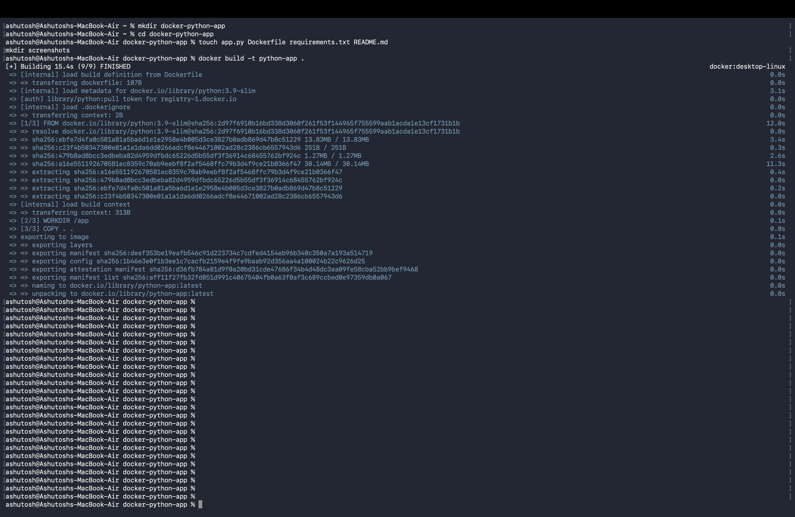
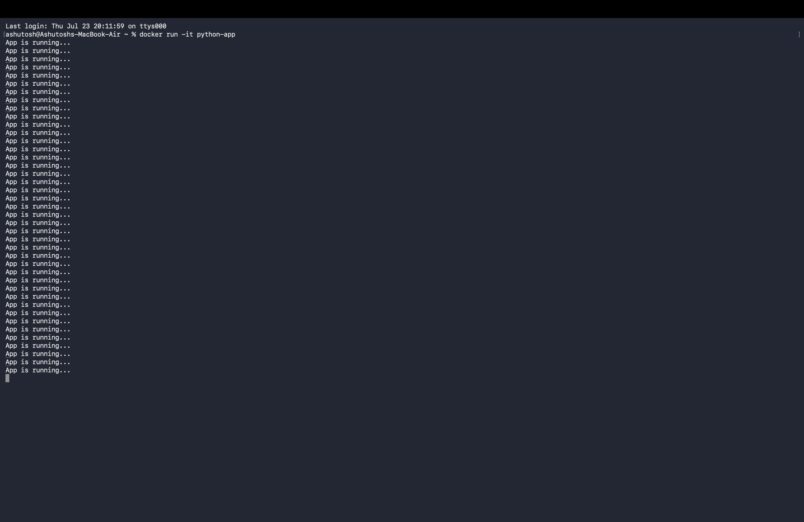
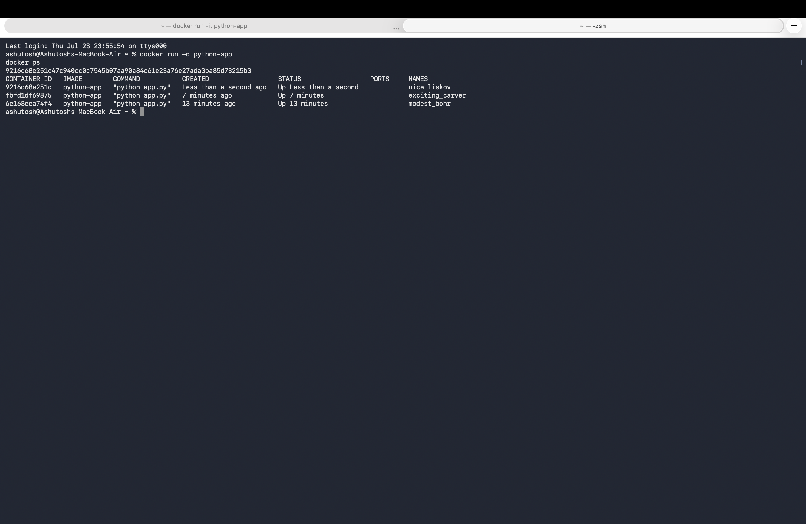
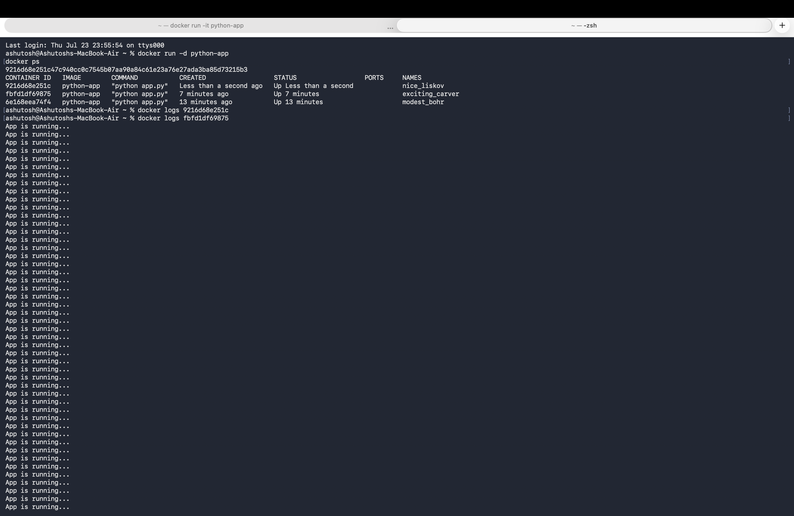

```markdown
# 🚀 Docker Python App

## 1. What I Built

I created a simple Python application and containerized it using Docker.  
The application runs continuously and prints logs inside the container.  
I built a Docker image and ran it as a container to understand how applications work in isolated environments.

---

## 2. Architecture


---

## 3. Tools Used

- Docker  
- Python  
- Git & GitHub  

---

## 4. Folder Structure

```

.
├── app.py
├── Dockerfile
├── requirements.txt
├── README.md
└── screenshots/

````

---

## 5. Steps to Run

```bash
# Build Docker image
docker build -t python-app .

# Run container
docker run python-app

# Run in background
docker run -d python-app

# Check running containers
docker ps

# Check logs
docker logs <container_id>
````

---

## 6. Commands Used

```bash
docker build -t python-app .
docker run python-app
docker run -d python-app
docker ps
docker logs <container_id>
docker stop <container_id>
docker rm <container_id>
```

---

## 7. Screenshots / Proof

| Step               | Screenshot                 |
| ------------------ | -------------------------- |
| Build Image        |  |
| Run Container      |    |
| Running Containers |     |
| Logs Output        |   |

---

## 8. Problems Faced and Fixes

| Problem               | Cause           | Fix                                    |
| --------------------- | --------------- | -------------------------------------- |
| Docker not running    | Service stopped | Started Docker service                 |
| Permission denied     | No sudo access  | Used sudo / added user to docker group |
| Container not visible | Ran without -d  | Used background mode                   |

---

## 9. What I Learned

* Dockerfile basics (FROM, WORKDIR, CMD)
* Difference between image and container
* Running containers in foreground and background
* Viewing logs using docker logs
* Managing container lifecycle

---

## 10. Cleanup

```bash
docker stop $(docker ps -aq)
docker rm $(docker ps -aq)
```

---

## 11. Explanation

This project demonstrates my understanding of Docker fundamentals.
I can create images, run containers, and debug logs.
It shows I understand how applications run inside containers and how to manage them.

```